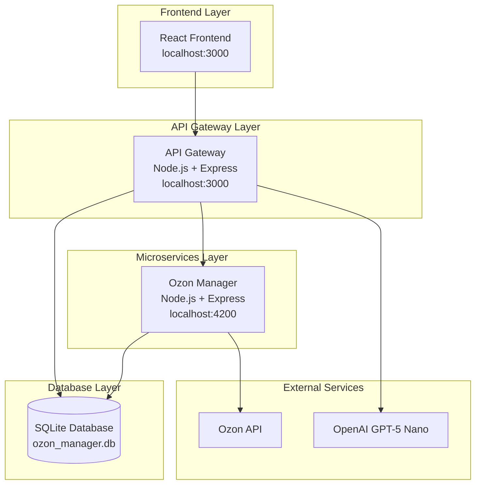

# 🧠 Katya Integration Guide - Boss AI Platform

**Для разработчика Николая**
**Дата:** 21 октября 2025
**Версия:** Integration Guide v1.0

---

## 🎯 Цель документа

Этот документ объясняет, как интегрировать Telegram бота "Катя" в существующую архитектуру Boss AI Platform. Содержит детальные примеры кода, архитектурные диаграммы и step-by-step инструкции.

---

## 🏗️ Архитектура платформы

### Текущая архитектура (до Кати)



### Новая архитектура (с Катей)

```mermaid
graph TB
    subgraph "Frontend Layer"
        FE[React Frontend<br/>localhost:3000]
        KATYA_SERVICE[Katya Service Config<br/>katya-service.json]
    end

    subgraph "API Gateway Layer"
        AG[API Gateway<br/>Node.js + Express<br/>localhost:3000]
        KATYA_PROXY[/api/katya/* proxy]
    end

    subgraph "Microservices Layer"
        OM[Ozon Manager<br/>Node.js + Express<br/>localhost:4200]
        KS[Katya Service<br/>Node.js + Express<br/>localhost:4300]
    end

    subgraph "Database Layer"
        DB[(SQLite Database<br/>ozon_manager.db<br/>+ Katya tables)]
    end

    subgraph "External Services"
        OZON[Ozon API]
        OPENAI[OpenAI GPT-5 Nano]
        TG[Telegram Bot API]
    end

    FE --> AG
    FE --> KATYA_SERVICE
    AG --> KATYA_PROXY
    AG --> OM
    AG --> OPENAI
    KATYA_PROXY --> KS
    KS --> TG
    KS --> OPENAI
    OM --> OZON
    AG --> DB
    OM --> DB
    KS --> DB
```

---

## 🔧 Как работает API Gateway

### Проксирование запросов

API Gateway использует `ProxyClient` для маршрутизации запросов к микросервисам:

```typescript
// backend/main/src/utils/proxy.ts
export class ProxyClient {
  constructor(private config: ProxyConfig) {}

  async request(
    method: string,
    path: string,
    data?: any,
    options?: RequestOptions
  ): Promise<any> {
    // Проксирование к микросервису
    const response = await axios({
      method,
      url: `${this.config.baseURL}${path}`,
      data,
      ...options,
    });

    return response.data;
  }
}
```

### Существующие прокси

```typescript
// backend/main/src/routes/ozon.routes.ts
const ozonProxy = new ProxyClient({
  baseURL: process.env.OZON_MANAGER_URL || "http://localhost:4200",
  timeout: 30000,
});

router.use("/api/ozon/*", async (req, res) => {
  const targetPath = req.originalUrl.replace("/api/ozon", "");
  const result = await ozonProxy.request(req.method, targetPath, req.body);
  res.json(result);
});
```

### Для Кати (новый прокси)

```typescript
// backend/main/src/routes/katya.routes.ts (СОЗДАТЬ!)
const katyaProxy = new ProxyClient({
  baseURL: process.env.KATYA_SERVICE_URL || "http://localhost:4300",
  timeout: 60000,
});

router.use("/api/katya/*", authenticateToken, async (req, res) => {
  const targetPath = req.originalUrl.replace("/api/katya", "");
  const result = await katyaProxy.request(req.method, targetPath, req.body, {
    headers: { Authorization: req.headers.authorization },
  });
  res.json(result);
});
```

---

## 💰 Биллинг система

### Как работает биллинг

1. **Middleware автоматически списывает средства** при AI запросах
2. **Проверка баланса** перед каждым запросом
3. **Атомарные транзакции** для предотвращения race conditions
4. **BT токены** как основная валюта

### Существующий биллинг middleware

```typescript
// backend/main/src/routes/ai.routes.ts
router.post("/chatgpt", authenticateToken, async (req, res) => {
  const { prompt, options } = req.body;
  const userId = (req as any).user.id;

  // 1. Проверить баланс
  const balance = await billingService.getBalance(userId);
  if (balance.balance_bt < 0.5) {
    return res.status(402).json({ error: "Insufficient funds" });
  }

  // 2. Сделать AI запрос
  const result = await aiServicesService.sendChatGPTRequest(prompt, options);

  // 3. Списать средства (автоматически)
  await billingService.charge(userId, "chatgpt_request", 0.5, "BT");

  res.json({ success: true, data: result });
});
```

### Для Кати (интеграция с биллингом)

```typescript
// В Katya Service - НЕ нужно дублировать биллинг!
// Просто используем /api/ai/chatgpt через платформу

export class PlatformGPTService {
  async summarize(
    messages: string[],
    userToken: string
  ): Promise<SummaryResult> {
    const response = await this.client.post(
      "/api/ai/chatgpt",
      {
        prompt: this.buildSummarizationPrompt(messages),
        options: { model: "gpt-4o-mini" },
      },
      {
        headers: { Authorization: `Bearer ${userToken}` },
      }
    );

    // Биллинг произойдет автоматически в API Gateway!
    return this.parseResponse(response.data);
  }
}
```

---

## 🔐 Аутентификация

### Telegram Login Widget

Пользователи авторизуются через Telegram Login Widget:

```typescript
// backend/main/src/services/auth.service.ts
export class AuthService {
  async validateTelegramLogin(loginData: TelegramLoginData): Promise<User> {
    // 1. Проверить HMAC подпись
    const isValid = this.verifyTelegramHash(loginData);
    if (!isValid) throw new Error("Invalid Telegram hash");

    // 2. Создать/найти пользователя
    const user = await this.findOrCreateUser(loginData);

    // 3. Создать JWT токен
    const token = jwt.sign({ userId: user.id }, process.env.JWT_SECRET);

    return { ...user, token };
  }
}
```

### JWT Middleware

```typescript
// backend/main/src/middleware/auth.middleware.ts
export const authenticateToken = (
  req: Request,
  res: Response,
  next: NextFunction
) => {
  const token = req.headers.authorization?.replace("Bearer ", "");

  if (!token) {
    return res.status(401).json({ error: "No token provided" });
  }

  try {
    const decoded = jwt.verify(token, process.env.JWT_SECRET);
    (req as any).user = decoded;
    next();
  } catch (error) {
    return res.status(401).json({ error: "Invalid token" });
  }
};
```

### Для Кати (Telegram Bot авторизация)

```typescript
// В Katya Service
export class UserChatMappingService {
  async getPlatformUserId(telegramUserId: number): Promise<number | null> {
    // Найти пользователя в таблице users по telegram_id
    const user = this.db
      .prepare(
        `
      SELECT id FROM users WHERE telegram_id = ?
    `
      )
      .get(telegramUserId);

    return user ? (user as any).id : null;
  }
}
```

---

## 🗄️ База данных

### Существующие таблицы

```sql
-- Пользователи (Telegram авторизация)
CREATE TABLE users (
  id INTEGER PRIMARY KEY AUTOINCREMENT,
  telegram_id BIGINT UNIQUE NOT NULL,
  username TEXT,
  first_name TEXT,
  last_name TEXT,
  photo_url TEXT,
  auth_date INTEGER NOT NULL,
  agreed_to_terms BOOLEAN DEFAULT 0,
  created_at INTEGER DEFAULT (strftime('%s', 'now')),
  last_login INTEGER DEFAULT (strftime('%s', 'now'))
);

-- Балансы (BT токены)
CREATE TABLE user_balance (
  user_id INTEGER PRIMARY KEY,
  balance_rub REAL DEFAULT 0.0,
  balance_bt REAL DEFAULT 0.0,
  currency TEXT DEFAULT 'RUB',
  updated_at INTEGER DEFAULT (strftime('%s', 'now')),
  FOREIGN KEY (user_id) REFERENCES users(id) ON DELETE CASCADE
);

-- Транзакции
CREATE TABLE transactions (
  id INTEGER PRIMARY KEY AUTOINCREMENT,
  user_id INTEGER NOT NULL,
  service_name TEXT NOT NULL,
  amount REAL NOT NULL,
  currency TEXT NOT NULL,
  transaction_type TEXT NOT NULL, -- 'charge', 'deposit'
  description TEXT,
  created_at INTEGER DEFAULT (strftime('%s', 'now')),
  FOREIGN KEY (user_id) REFERENCES users(id) ON DELETE CASCADE
);

-- Тарифы сервисов
CREATE TABLE service_pricing (
  id INTEGER PRIMARY KEY AUTOINCREMENT,
  service_name TEXT UNIQUE NOT NULL,
  unit_type TEXT NOT NULL, -- 'request', 'per_100', 'per_minute'
  price_per_unit REAL NOT NULL,
  currency TEXT NOT NULL,
  is_active BOOLEAN DEFAULT 1,
  created_at INTEGER DEFAULT (strftime('%s', 'now'))
);
```

### Новые таблицы для Кати

```sql
-- Чаты пользователей (связь user ↔ telegram chat)
CREATE TABLE katya_user_chats (
  id INTEGER PRIMARY KEY AUTOINCREMENT,
  user_id INTEGER NOT NULL,
  telegram_chat_id BIGINT NOT NULL,
  chat_name TEXT NOT NULL,
  chat_type TEXT DEFAULT 'group',
  is_active BOOLEAN DEFAULT 1,
  created_at INTEGER DEFAULT (strftime('%s', 'now')),
  FOREIGN KEY (user_id) REFERENCES users(id) ON DELETE CASCADE,
  UNIQUE(user_id, telegram_chat_id)
);

-- История сообщений (с изоляцией!)
CREATE TABLE chat_messages (
  id INTEGER PRIMARY KEY AUTOINCREMENT,
  user_id INTEGER NOT NULL, -- владелец данных
  telegram_chat_id BIGINT NOT NULL,
  message_id BIGINT NOT NULL,
  telegram_user_id BIGINT,
  username TEXT,
  first_name TEXT,
  text TEXT NOT NULL,
  is_katya_mention BOOLEAN DEFAULT 0,
  created_at INTEGER DEFAULT (strftime('%s', 'now')),
  FOREIGN KEY (user_id) REFERENCES users(id) ON DELETE CASCADE,
  UNIQUE(user_id, telegram_chat_id, message_id)
);

-- Суммаризированные контексты
CREATE TABLE chat_summaries (
  id INTEGER PRIMARY KEY AUTOINCREMENT,
  user_id INTEGER NOT NULL,
  telegram_chat_id BIGINT NOT NULL,
  summary_text TEXT NOT NULL,
  message_count INTEGER DEFAULT 0,
  keywords TEXT, -- JSON
  topics TEXT,   -- JSON
  decisions TEXT, -- JSON
  created_at INTEGER DEFAULT (strftime('%s', 'now')),
  FOREIGN KEY (user_id) REFERENCES users(id) ON DELETE CASCADE
);

-- Контексты обсуждений / решения
CREATE TABLE chat_contexts (
  id INTEGER PRIMARY KEY AUTOINCREMENT,
  user_id INTEGER NOT NULL,
  telegram_chat_id BIGINT NOT NULL,
  topic TEXT NOT NULL,
  description TEXT,
  keywords TEXT, -- JSON
  decision TEXT,
  decided_by TEXT,
  decided_at INTEGER,
  created_at INTEGER DEFAULT (strftime('%s', 'now')),
  FOREIGN KEY (user_id) REFERENCES users(id) ON DELETE CASCADE
);

-- База знаний Q&A
CREATE TABLE knowledge_base (
  id INTEGER PRIMARY KEY AUTOINCREMENT,
  user_id INTEGER NOT NULL,
  telegram_chat_id BIGINT NOT NULL,
  question TEXT NOT NULL,
  answer TEXT NOT NULL,
  source_message_ids TEXT, -- JSON
  context_id INTEGER,
  created_by TEXT,
  relevance_score REAL DEFAULT 1.0,
  created_at INTEGER DEFAULT (strftime('%s', 'now')),
  FOREIGN KEY (user_id) REFERENCES users(id) ON DELETE CASCADE,
  FOREIGN KEY (context_id) REFERENCES chat_contexts(id) ON DELETE SET NULL
);

-- История запросов Кати (для биллинга)
CREATE TABLE katya_requests (
  id INTEGER PRIMARY KEY AUTOINCREMENT,
  user_id INTEGER NOT NULL,
  telegram_chat_id BIGINT,
  request_type TEXT NOT NULL, -- 'summarize', 'search', 'question'
  request_data TEXT, -- JSON
  response_data TEXT, -- JSON
  cost_bt REAL NOT NULL,
  cost_rub REAL NOT NULL,
  duration_ms INTEGER,
  created_at INTEGER DEFAULT (strftime('%s', 'now')),
  FOREIGN KEY (user_id) REFERENCES users(id) ON DELETE CASCADE
);

-- Настройки Кати для пользователей
CREATE TABLE katya_user_settings (
  user_id INTEGER PRIMARY KEY,
  telegram_enabled BOOLEAN DEFAULT 1,
  platform_chat_enabled BOOLEAN DEFAULT 0,
  auto_summarize BOOLEAN DEFAULT 0,
  auto_summarize_threshold INTEGER DEFAULT 100,
  context_window INTEGER DEFAULT 50,
  ai_model TEXT DEFAULT 'gpt-4o-mini',
  updated_at INTEGER DEFAULT (strftime('%s', 'now')),
  FOREIGN KEY (user_id) REFERENCES users(id) ON DELETE CASCADE
);
```

---

## 🎨 Frontend Service Configuration

### Как работает динамическая загрузка сервисов

Frontend загружает сервисы из `public/services/*.json` файлов:

```typescript
// frontend/src/services/ServiceManager.ts
export class ServiceManager {
  async loadService(serviceId: string): Promise<Service> {
    const response = await fetch(`/services/${serviceId}.json`);
    const service = await response.json();

    // Регистрируем сервис
    this.services.set(serviceId, service);

    return service;
  }

  async executeTool(
    serviceId: string,
    toolId: string,
    params: any
  ): Promise<any> {
    const service = this.services.get(serviceId);
    const tool = service.tools.find((t) => t.id === toolId);

    // Выполняем API запрос
    const response = await fetch(tool.chatApiEndpoint, {
      method: "POST",
      headers: { Authorization: `Bearer ${this.getToken()}` },
      body: JSON.stringify(params),
    });

    return response.json();
  }
}
```

### Пример: chatgpt-service.json

```json
{
  "id": "chatgpt-service",
  "name": "ChatGPT",
  "description": "AI ассистент OpenAI GPT-5 Nano",
  "icon": "MessageSquare",
  "version": "1.0.0",
  "isActive": true,
  "category": "ai",
  "priority": 1,
  "author": "Boss AI Team",
  "tools": [
    {
      "id": "chat-completion",
      "name": "💬 Чат",
      "description": "Общение с AI ассистентом",
      "icon": "MessageSquare",
      "action": "chat",
      "isEnabled": true,
      "category": "conversation",
      "isChatFunction": true,
      "chatPrompt": "Ответь на вопрос: {userInput}",
      "chatApiEndpoint": "/api/ai/chatgpt",
      "pricing": {
        "type": "per_request",
        "cost_bt": 0.5,
        "cost_rub": 5.0
      },
      "options": {
        "model": "gpt-4o-mini",
        "temperature": 0.7,
        "max_tokens": 2000
      }
    }
  ],
  "telegram": {
    "enabled": false
  }
}
```

### Для Кати (katya-service.json)

```json
{
  "id": "katya-ai-service",
  "name": "Катя AI",
  "description": "AI-ассистент с распределенной памятью команды",
  "icon": "Brain",
  "version": "1.0.0",
  "isActive": true,
  "category": "ai",
  "priority": 2,
  "author": "Николай для BOSS AI Team",
  "tools": [
    {
      "id": "summarize-chat",
      "name": "📊 Суммаризация",
      "description": "Подводит итоги обсуждений",
      "icon": "FileText",
      "action": "summarize",
      "isEnabled": true,
      "category": "analysis",
      "isChatFunction": true,
      "chatPrompt": "Подведи итоги: {userInput}",
      "chatApiEndpoint": "/api/katya/summarize",
      "pricing": {
        "type": "per_request",
        "cost_bt": 0.5,
        "cost_rub": 5.0
      }
    },
    {
      "id": "search-history",
      "name": "🔍 Поиск",
      "description": "Ищет информацию в истории чатов",
      "icon": "Search",
      "action": "search",
      "isEnabled": true,
      "category": "search",
      "isChatFunction": true,
      "chatPrompt": "Найди в истории: {userInput}",
      "chatApiEndpoint": "/api/katya/search",
      "pricing": {
        "type": "per_request",
        "cost_bt": 0.2,
        "cost_rub": 2.0
      }
    },
    {
      "id": "ask-question",
      "name": "💬 Вопрос",
      "description": "Отвечает на вопросы по контексту команды",
      "icon": "HelpCircle",
      "action": "question",
      "isEnabled": true,
      "category": "conversation",
      "isChatFunction": true,
      "chatPrompt": "Ответь на вопрос: {userInput}",
      "chatApiEndpoint": "/api/katya/question",
      "pricing": {
        "type": "per_request",
        "cost_bt": 0.3,
        "cost_rub": 3.0
      }
    },
    {
      "id": "show-decisions",
      "name": "✅ Решения",
      "description": "Показывает принятые решения",
      "icon": "CheckCircle",
      "action": "decisions",
      "isEnabled": true,
      "category": "analysis",
      "isChatFunction": true,
      "chatPrompt": "Покажи решения: {userInput}",
      "chatApiEndpoint": "/api/katya/decisions",
      "pricing": {
        "type": "per_request",
        "cost_bt": 0.0,
        "cost_rub": 0.0
      }
    }
  ],
  "telegram": {
    "enabled": true,
    "bot_username": "katya_boss_ai_bot"
  }
}
```

---

## 🚀 Step-by-Step: Добавление нового микросервиса

### 1. Создать Katya Service

```bash
mkdir -p backend/katya-service/src
cd backend/katya-service
npm init -y
npm install express better-sqlite3 node-telegram-bot-api axios
npm install -D typescript @types/node @types/express ts-node nodemon
```

### 2. Структура Katya Service

```
backend/katya-service/
├── src/
│   ├── index.ts                 # Express server (port 4300)
│   ├── routes/                  # API routes
│   │   ├── summarize.route.ts  # POST /summarize
│   │   ├── search.route.ts     # POST /search
│   │   ├── question.route.ts   # POST /question
│   │   ├── decisions.route.ts  # GET /decisions
│   │   └── health.route.ts     # GET /health
│   ├── telegram/               # Telegram Bot
│   │   └── bot.ts             # Bot logic
│   ├── services/              # Business logic
│   │   ├── platform-gpt.service.ts    # Проксирование к /api/ai/chatgpt
│   │   ├── user-chat-mapping.service.ts # Mapping TG user → platform user
│   │   └── context-manager.service.ts  # Управление контекстом
│   ├── database/              # Database layer
│   │   ├── connection.ts      # SQLite connection
│   │   ├── migrations.ts      # Миграции таблиц
│   │   └── repositories/      # Data access
│   │       ├── messages.repo.ts
│   │       ├── summaries.repo.ts
│   │       └── contexts.repo.ts
│   └── utils/                 # Utilities
│       ├── logger.ts
│       └── prompts.ts         # GPT промпты
├── package.json
├── tsconfig.json
├── .env.example
└── README.md
```

### 3. Добавить в API Gateway

```typescript
// backend/main/src/routes/katya.routes.ts
import { Router } from "express";
import { authenticateToken } from "../middleware/auth.middleware";
import { ProxyClient } from "../utils/proxy";

const router = Router();

const createKatyaProxy = (): ProxyClient => {
  return new ProxyClient({
    baseURL: process.env.KATYA_SERVICE_URL || "http://localhost:4300",
    timeout: 60000,
    headers: {
      "X-Service": "katya-ai",
    },
  });
};

const katyaProxy = createKatyaProxy();

// Проксирование всех запросов к Кате
router.use("/api/katya/*", authenticateToken, async (req, res) => {
  try {
    const targetPath = req.originalUrl.replace("/api/katya", "");

    const result = await katyaProxy.request(
      req.method as any,
      targetPath,
      req.body,
      {
        headers: {
          Authorization: req.headers.authorization, // Передаем токен!
        },
      }
    );

    res.json(result);
  } catch (error: any) {
    res.status(error.status || 500).json(
      error.data || {
        success: false,
        error: error.message,
      }
    );
  }
});

export default router;
```

### 4. Добавить в main index.ts

```typescript
// backend/main/src/index.ts
import katyaRoutes from "./routes/katya.routes";

// В setupRoutes():
this.app.use(katyaRoutes);
```

### 5. Добавить в PM2 конфигурацию

```javascript
// ecosystem.config.js
{
  name: "boss-ai-katya-service",
  script: "dist/index.js",
  cwd: "/var/www/boss-ai/backend/katya-service",
  instances: 1,
  exec_mode: "fork",
  env: {
    NODE_ENV: "production",
    PORT: 4300,
    DB_PATH: "/var/www/boss-ai/backend/ozon-manager/data/ozon_manager.db",
    API_GATEWAY_URL: "https://boss-ai.online",
    TELEGRAM_BOT_TOKEN: "<получить от @BotFather>",
    SYSTEM_TOKEN: "<взять из платформы>"
  }
}
```

### 6. Создать katya-service.json

```json
{
  "id": "katya-ai-service",
  "name": "Катя AI",
  "description": "AI-ассистент с распределенной памятью команды",
  "icon": "Brain",
  "version": "1.0.0",
  "isActive": true,
  "category": "ai",
  "priority": 2,
  "author": "Николай для BOSS AI Team",
  "tools": [
    // ... см. выше
  ],
  "telegram": {
    "enabled": true,
    "bot_username": "katya_boss_ai_bot"
  }
}
```

---

## 🔧 Примеры кода

### PlatformGPTService (проксирование к платформе)

```typescript
// src/services/platform-gpt.service.ts
import axios, { AxiosInstance } from "axios";

export class PlatformGPTService {
  private client: AxiosInstance;
  private apiGatewayUrl: string;

  constructor(apiGatewayUrl: string = "https://boss-ai.online") {
    this.apiGatewayUrl = apiGatewayUrl;

    this.client = axios.create({
      baseURL: this.apiGatewayUrl,
      timeout: 60000,
      headers: {
        "Content-Type": "application/json",
        "X-Service": "katya-ai",
      },
    });
  }

  async summarize(
    messages: string[],
    userToken: string
  ): Promise<SummaryResult> {
    const prompt = this.buildSummarizationPrompt(messages);

    try {
      const response = await this.client.post(
        "/api/ai/chatgpt",
        {
          prompt,
          options: {
            model: "gpt-4o-mini",
            temperature: 0.3,
            max_tokens: 2000,
          },
        },
        {
          headers: {
            Authorization: `Bearer ${userToken}`,
          },
        }
      );

      if (!response.data.success) {
        throw new Error(response.data.error?.message || "AI request failed");
      }

      const content = response.data.data.choices[0].message.content;

      return {
        summary: content,
        topics: this.extractTopics(content),
        decisions: this.extractDecisions(content),
        keywords: this.extractKeywords(content),
      };
    } catch (error: any) {
      console.error("Ошибка суммаризации:", error);

      if (error.response?.status === 402) {
        throw new Error("Insufficient funds");
      }

      throw error;
    }
  }

  private buildSummarizationPrompt(messages: string[]): string {
    return `Ты - Катя, AI-ассистент команды Boss AI.
Твоя задача - суммаризировать обсуждения команды.

Сообщения (${messages.length} шт.):
${messages.join("\n---\n")}

Выдели:
- Краткое резюме (2-3 предложения)
- Основные темы обсуждения
- Принятые решения (кто решил, когда)
- Нерешенные вопросы
- Ключевые слова

Ответ дай структурированно.`;
  }

  private extractTopics(text: string): string[] {
    const matches = text.match(/темы?:?\s*([^\n]+)/i);
    if (matches) {
      return matches[1]
        .split(",")
        .map((t) => t.trim())
        .filter(Boolean);
    }
    return [];
  }

  private extractDecisions(text: string): Array<{ decision: string }> {
    const matches = text.match(/решени[яе]:?\s*([^\n]+)/i);
    if (matches) {
      return [{ decision: matches[1].trim() }];
    }
    return [];
  }

  private extractKeywords(text: string): string[] {
    const words = text.toLowerCase().match(/\b\w{4,}\b/g) || [];
    return [...new Set(words)].slice(0, 5);
  }
}

interface SummaryResult {
  summary: string;
  topics: string[];
  decisions: Array<{ decision: string }>;
  keywords: string[];
}
```

### UserChatMappingService (изоляция данных)

```typescript
// src/services/user-chat-mapping.service.ts
import Database from "better-sqlite3";

export class UserChatMappingService {
  private db: Database.Database;

  constructor(db: Database.Database) {
    this.db = db;
  }

  async getPlatformUserId(telegramUserId: number): Promise<number | null> {
    const user = this.db
      .prepare(
        `
      SELECT id FROM users WHERE telegram_id = ?
    `
      )
      .get(telegramUserId);

    return user ? (user as any).id : null;
  }

  async registerUserChat(
    userId: number,
    telegramChatId: number,
    chatName: string
  ): Promise<void> {
    this.db
      .prepare(
        `
      INSERT OR IGNORE INTO katya_user_chats
        (user_id, telegram_chat_id, chat_name, is_active)
      VALUES (?, ?, ?, 1)
    `
      )
      .run(userId, telegramChatId, chatName);
  }

  async hasAccessToChat(
    userId: number,
    telegramChatId: number
  ): Promise<boolean> {
    const chat = this.db
      .prepare(
        `
      SELECT id FROM katya_user_chats
      WHERE user_id = ? AND telegram_chat_id = ? AND is_active = 1
    `
      )
      .get(userId, telegramChatId);

    return !!chat;
  }

  async getUserChats(userId: number): Promise<UserChat[]> {
    return this.db
      .prepare(
        `
      SELECT
        telegram_chat_id,
        chat_name,
        created_at,
        (SELECT COUNT(*) FROM chat_messages
         WHERE user_id = ? AND telegram_chat_id = k.telegram_chat_id) as message_count
      FROM katya_user_chats k
      WHERE user_id = ? AND is_active = 1
      ORDER BY created_at DESC
    `
      )
      .all(userId, userId) as UserChat[];
  }
}

interface UserChat {
  telegram_chat_id: number;
  chat_name: string;
  created_at: number;
  message_count: number;
}
```

### MessagesRepository (с изоляцией)

```typescript
// src/database/repositories/messages.repo.ts
import Database from "better-sqlite3";

export class MessagesRepository {
  private db: Database.Database;

  constructor(db: Database.Database) {
    this.db = db;
  }

  async create(message: CreateMessageData): Promise<void> {
    this.db
      .prepare(
        `
      INSERT INTO chat_messages
        (user_id, telegram_chat_id, message_id, telegram_user_id, username, first_name, text, is_katya_mention)
      VALUES (?, ?, ?, ?, ?, ?, ?, ?)
    `
      )
      .run(
        message.userId,
        message.telegramChatId,
        message.messageId,
        message.telegramUserId,
        message.username,
        message.firstName,
        message.text,
        message.isKatyaMention ? 1 : 0
      );
  }

  async getLastMessages(
    userId: number,
    telegramChatId: number,
    limit: number = 50
  ): Promise<Message[]> {
    return this.db
      .prepare(
        `
      SELECT * FROM chat_messages
      WHERE user_id = ? AND telegram_chat_id = ?
      ORDER BY created_at DESC
      LIMIT ?
    `
      )
      .all(userId, telegramChatId, limit) as Message[];
  }

  async search(
    userId: number,
    telegramChatId: number,
    query: string,
    limit: number = 10
  ): Promise<Message[]> {
    return this.db
      .prepare(
        `
      SELECT * FROM chat_messages
      WHERE user_id = ? AND telegram_chat_id = ? AND text LIKE ?
      ORDER BY created_at DESC
      LIMIT ?
    `
      )
      .all(userId, telegramChatId, `%${query}%`, limit) as Message[];
  }
}

interface CreateMessageData {
  userId: number;
  telegramChatId: number;
  messageId: number;
  telegramUserId: number;
  username: string;
  firstName: string;
  text: string;
  isKatyaMention: boolean;
}

interface Message {
  id: number;
  user_id: number;
  telegram_chat_id: number;
  message_id: number;
  telegram_user_id: number;
  username: string;
  first_name: string;
  text: string;
  is_katya_mention: boolean;
  created_at: number;
}
```

---

## 🧪 Тестирование интеграции

### 1. Проверка API Gateway

```bash
# Проверить что API Gateway запущен
curl http://localhost:3000/api/health

# Проверить что Ozon Manager доступен
curl http://localhost:3000/api/ozon/health
```

### 2. Проверка Katya Service

```bash
# Проверить что Katya Service запущен
curl http://localhost:4300/health

# Проверить что проксирование работает
curl http://localhost:3000/api/katya/health
```

### 3. Проверка базы данных

```sql
-- Проверить что таблицы созданы
.tables

-- Проверить пользователей
SELECT id, telegram_id, username FROM users LIMIT 5;

-- Проверить балансы
SELECT user_id, balance_bt FROM user_balance LIMIT 5;
```

### 4. Проверка биллинга

```bash
# Тестовый AI запрос (должен списать BT токены)
curl -X POST http://localhost:3000/api/ai/chatgpt \
  -H "Authorization: Bearer <user_token>" \
  -H "Content-Type: application/json" \
  -d '{"prompt": "Привет", "options": {"model": "gpt-4o-mini"}}'
```

---

## 📋 Checklist для интеграции

### Backend (Katya Service)

- [ ] Express server на port 4300
- [ ] Подключение к SQLite БД (shared с платформой)
- [ ] Миграции новых таблиц
- [ ] PlatformGPTService (проксирование к /api/ai/chatgpt)
- [ ] UserChatMappingService (изоляция данных)
- [ ] MessagesRepository (CRUD с изоляцией)
- [ ] API routes (summarize, search, question, decisions)
- [ ] Telegram Bot (логирование, @Катя mentions)
- [ ] Health check endpoint

### API Gateway

- [ ] Добавить /api/katya/\* routes
- [ ] Проксирование к Katya Service
- [ ] Применить authenticateToken middleware
- [ ] Обновить ecosystem.config.js

### Frontend

- [ ] Создать katya-service.json
- [ ] Добавить в public/services/
- [ ] Проверить загрузку сервиса

### Database

- [ ] Выполнить миграции таблиц Кати
- [ ] Проверить индексы для производительности
- [ ] Проверить изоляцию данных

### Testing

- [ ] Unit тесты для сервисов
- [ ] Integration тесты для API
- [ ] Тестирование Telegram бота
- [ ] Тестирование изоляции данных
- [ ] E2E тесты с платформой

---

## 🌐 Веб-интерфейс для просмотра чатов (УЖЕ РЕАЛИЗОВАН!)

### Описание

В Boss AI Platform уже добавлен полнофункциональный веб-интерфейс для работы с Telegram чатами Кати! Пользователи могут просматривать свои чаты прямо в браузере без необходимости открывать Telegram.

### Backend Routes (уже работают!)

Файл: `backend/main/src/routes/katya-chats.routes.ts`

```typescript
// GET /api/katya-chats - Список всех чатов пользователя
router.get("/", authenticateToken, async (req, res) => {
  const userId = (req as any).user.id;
  const chats = db
    .prepare(
      `
    SELECT k.telegram_chat_id, k.chat_name, k.chat_type,
           COUNT(cm.id) as message_count,
           MAX(cm.created_at) as last_activity
    FROM katya_user_chats k
    LEFT JOIN chat_messages cm ON k.telegram_chat_id = cm.telegram_chat_id
    WHERE k.user_id = ? AND k.is_active = 1
    GROUP BY k.telegram_chat_id
  `
    )
    .all(userId);

  res.json({ success: true, data: { chats } });
});

// GET /api/katya-chats/:chatId/messages - История сообщений
router.get("/:chatId/messages", authenticateToken, async (req, res) => {
  const { chatId } = req.params;
  const { limit = 50, offset = 0 } = req.query;

  // Проверка доступа + получение сообщений
  // ... (см. полный код в файле)
});

// POST /api/katya-chats/:chatId/summarize - Суммаризация через AI
router.post("/:chatId/summarize", authenticateToken, async (req, res) => {
  // 1. Проверить баланс
  const balance = billingService.getBalance(userId);
  if (balance.balance_bt < 0.5) {
    return res.status(402).json({ error: "Insufficient funds" });
  }

  // 2. Получить сообщения
  const messages = db.prepare(`...`).all();

  // 3. Запрос к AI
  const aiService = new AIServicesService();
  const result = await aiService.sendChatGPTRequest(prompt);

  // 4. Списать средства
  billingService.charge(userId, 0.5, "katya_summarize");

  res.json({ success: true, data: { summary: result } });
});
```

### Frontend компоненты (уже реализованы!)

#### 1. KatyaChats.tsx - Список чатов

Файл: `frontend/src/pages/KatyaChats.tsx`

```typescript
// Показывает все TG чаты пользователя с Катей
const KatyaChats = () => {
  const [chats, setChats] = useState<KatyaChat[]>([]);

  useEffect(() => {
    fetch("/api/katya-chats", {
      headers: { Authorization: `Bearer ${token}` },
    })
      .then((res) => res.json())
      .then((data) => setChats(data.data.chats));
  }, []);

  return (
    <div>
      {chats.map((chat) => (
        <ChatCard
          key={chat.telegram_chat_id}
          chat={chat}
          onOpen={() => navigate(`/katya-chats/${chat.telegram_chat_id}`)}
          onSummarize={() => handleSummarize(chat.telegram_chat_id)}
        />
      ))}
    </div>
  );
};
```

#### 2. KatyaChatInterface.tsx - Просмотр чата

Файл: `frontend/src/pages/KatyaChatInterface.tsx`

```typescript
// Показывает историю сообщений конкретного чата
const KatyaChatInterface = () => {
  const { chatId } = useParams();
  const [messages, setMessages] = useState([]);
  const [stats, setStats] = useState(null);

  // Загрузка сообщений с пагинацией
  const fetchMessages = async (offset = 0) => {
    const res = await fetch(
      `/api/katya-chats/${chatId}/messages?limit=50&offset=${offset}`,
      { headers: { Authorization: `Bearer ${token}` } }
    );
    const data = await res.json();
    setMessages((prev) => [...prev, ...data.data.messages]);
  };

  // Суммаризация
  const handleSummarize = async () => {
    const res = await fetch(`/api/katya-chats/${chatId}/summarize`, {
      method: "POST",
      headers: {
        Authorization: `Bearer ${token}`,
        "Content-Type": "application/json",
      },
      body: JSON.stringify({ message_count: 100 }),
    });

    if (res.status === 402) {
      alert("Недостаточно средств. Пополните баланс BT токенов.");
      return;
    }

    const data = await res.json();
    // Показать результат
  };

  return (
    <div>
      <ChatHeader chat={chatDetails} onSummarize={handleSummarize} />
      <MessagesList messages={messages} />
      <ChatStats stats={stats} />
    </div>
  );
};
```

#### 3. Sidebar - Кнопка "Катя чаты"

Файл: `frontend/src/components/Sidebar/Sidebar.tsx`

```typescript
// Кнопка уже добавлена в Sidebar
<div className={cn(isCollapsed ? "p-0" : "px-3 py-2")}>
  <button
    onClick={() => {
      if (state.layout.activeSection === "katya-chats") {
        handleSectionSwitch("workspace");
      } else {
        handleSectionSwitch("katya-chats");
      }
    }}
    className={cn(
      "sidebar-service-button",
      isCollapsed && "compact",
      state.layout.activeSection === "katya-chats" && "active"
    )}
    title="Катя чаты"
  >
    <Brain className="icon" />
    {!isCollapsed && (
      <div className="service-content">
        <div className="service-title">Катя чаты</div>
      </div>
    )}
  </button>
</div>
```

### Интеграция с App.tsx

Файл: `frontend/src/App.tsx`

```typescript
import KatyaChats from "@/pages/KatyaChats";

// В рендере основного контента
{
  state.layout.activeSection === "ozon-manager" ? (
    <OzonManager />
  ) : state.layout.activeSection === "photo-studio" ? (
    <PhotoStudioService />
  ) : state.layout.activeSection === "katya-chats" ? (
    <KatyaChats />
  ) : (
    <Workspace />
  );
}
```

### Что должен сделать Николай

#### 1. Создать таблицы в БД

```sql
-- В ozon_manager.db
CREATE TABLE IF NOT EXISTS katya_user_chats (
  id INTEGER PRIMARY KEY AUTOINCREMENT,
  user_id INTEGER NOT NULL REFERENCES users(id),
  telegram_chat_id BIGINT NOT NULL,
  chat_name TEXT NOT NULL,
  chat_type TEXT NOT NULL,
  is_active BOOLEAN DEFAULT 1,
  created_at INTEGER DEFAULT (strftime('%s', 'now')),
  UNIQUE(user_id, telegram_chat_id)
);

CREATE TABLE IF NOT EXISTS chat_messages (
  id INTEGER PRIMARY KEY AUTOINCREMENT,
  user_id INTEGER NOT NULL REFERENCES users(id),
  telegram_chat_id BIGINT NOT NULL,
  message_id BIGINT NOT NULL,
  telegram_user_id BIGINT NOT NULL,
  username TEXT,
  first_name TEXT,
  text TEXT NOT NULL,
  is_katya_mention BOOLEAN DEFAULT 0,
  created_at INTEGER DEFAULT (strftime('%s', 'now')),
  UNIQUE(telegram_chat_id, message_id)
);
```

#### 2. Логировать сообщения в боте

```typescript
// В Telegram боте при получении сообщения
bot.on("message", async (msg) => {
  // 1. Получить user_id из платформы (связка TG ↔ platform)
  const platformUserId = await getUserIdByTelegramId(msg.from.id);

  // 2. Сохранить сообщение
  db.prepare(
    `
    INSERT INTO chat_messages (
      user_id, telegram_chat_id, message_id,
      telegram_user_id, username, first_name, text, is_katya_mention
    ) VALUES (?, ?, ?, ?, ?, ?, ?, ?)
  `
  ).run(
    platformUserId,
    msg.chat.id,
    msg.message_id,
    msg.from.id,
    msg.from.username,
    msg.from.first_name,
    msg.text,
    msg.text?.includes("@Катя") ? 1 : 0
  );

  // 3. Если чат новый - создать запись
  db.prepare(
    `
    INSERT OR IGNORE INTO katya_user_chats (
      user_id, telegram_chat_id, chat_name, chat_type
    ) VALUES (?, ?, ?, ?)
  `
  ).run(
    platformUserId,
    msg.chat.id,
    msg.chat.title || msg.chat.first_name,
    msg.chat.type
  );
});
```

#### 3. Тестирование

```bash
# 1. Авторизоваться на https://boss-ai.online через Telegram
# 2. Открыть "🧠 Катя чаты" в левой панели
# 3. Должен появиться список чатов (если бот логировал)
# 4. Кликнуть на чат → увидеть историю
# 5. Кликнуть "Суммаризировать" → получить AI саммари
```

### Файлы для изучения

- `backend/main/src/routes/katya-chats.routes.ts` - полный код API
- `frontend/src/pages/KatyaChats.tsx` - UI списка чатов
- `frontend/src/pages/KatyaChatInterface.tsx` - UI просмотра чата
- `frontend/src/components/Sidebar/Sidebar.tsx` - кнопка в меню
- `frontend/src/App.tsx` - роутинг секций

---

## 🆘 Troubleshooting

### Проблема: "Cannot connect to Katya Service"

**Решение:**

```bash
# Проверить что Katya Service запущен
pm2 status
pm2 logs boss-ai-katya-service

# Перезапустить
pm2 restart boss-ai-katya-service
```

### Проблема: "Database is locked"

**Решение:**

```bash
# Проверить процессы
ps aux | grep sqlite

# Убить зависшие процессы
pkill -f sqlite

# Перезапустить сервисы
pm2 restart all
```

### Проблема: "401 Unauthorized" в Katya

**Решение:**

- Проверить что токен передается в заголовке Authorization
- Проверить что authenticateToken middleware работает
- Проверить JWT_SECRET в .env

### Проблема: "402 Insufficient funds"

**Решение:**

- Проверить баланс пользователя в user_balance
- Пополнить баланс через админку
- Проверить service*pricing для katya*\* сервисов

---

**Удачи в интеграции! 🚀**
