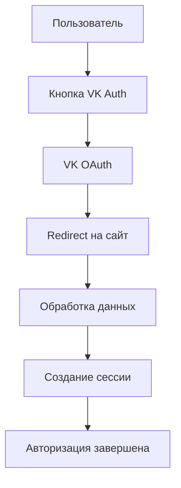

# 🔵 VK ID АВТОРИЗАЦИЯ - ПОЛНОЕ РУКОВОДСТВО

Детальное руководство по интеграции авторизации через VK ID в BARSUKOV OS платформу.

## 📋 Содержание

- [Обзор](#обзор)
- [Быстрый старт](#быстрый-старт)
- [Техническая интеграция](#техническая-интеграция)
- [Безопасность](#безопасность)
- [Кастомизация](#кастомизация)
- [Обработка ошибок](#обработка-ошибок)
- [Тестирование](#тестирование)
- [Развертывание](#развертывание)
- [FAQ](#faq)

---

## 🎯 Обзор

### Что такое VK ID?

VK ID — это система единого входа от ВКонтакте, которая позволяет пользователям авторизоваться на вашем сайте, используя свой аккаунт VK.

### Преимущества для BARSUKOV OS

- ✅ **Бесплатно** - Полностью бесплатное использование API
- ✅ **Быстро** - Интеграция за 30 минут
- ✅ **Безопасно** - OAuth 2.0 протокол
- ✅ **Популярно** - 80% россиян имеют аккаунт VK
- ✅ **Легально** - Соответствует российскому законодательству

### Что можно получить от пользователя

- **Базовая информация**: ID, имя, фамилия, фото
- **Контактные данные**: email (при разрешении)
- **Дополнительно**: дата рождения, пол (при разрешении)

---

## 🚀 Быстрый старт

### Шаг 1: Создание приложения VK (5 минут)

1. **Переходим на** [vk.com/dev](https://vk.com/dev)
2. **Входим** в свой аккаунт VK
3. **Создаем приложение:**
   ```
   Название: BARSUKOV OS Auth
   Платформа: Веб-сайт
   Домен: your-domain.com
   Redirect URI: https://your-domain.com/auth/vk/callback
   ```
4. **Получаем ключи:**
   - **App ID**: `12345678`
   - **Secret Key**: `AbCdEfGhIjKlMnOp`

### Шаг 2: Простейшая интеграция (10 минут)

```html
<!DOCTYPE html>
<html>
<head>
    <script src="https://vk.com/js/api/openapi.js?169"></script>
</head>
<body>
    <div id="vk_auth"></div>

    <script>
        VK.init({ apiId: 12345678 });
        VK.Widgets.Auth('vk_auth', {
            onAuth: function(data) {
                console.log('Пользователь авторизован:', data);
                // Ваша логика обработки
            }
        });
    </script>
</body>
</html>
```

### Шаг 3: Готово! ✅

Авторизация через VK уже работает на вашем сайте.

---

## 🔧 Техническая интеграция

### Архитектура интеграции



### Frontend интеграция

#### 1. Подключение VK API

```html
<!-- В <head> -->
<script src="https://vk.com/js/api/openapi.js?169"></script>
```

#### 2. Инициализация

```javascript
// Инициализация VK API
VK.init({
    apiId: process.env.VITE_VK_APP_ID
});
```

#### 3. Создание виджета авторизации

```javascript
// Создание виджета
VK.Widgets.Auth('vk_auth', {
    width: 200,
    onAuth: function(data) {
        handleVKAuth(data);
    },
    onLogout: function() {
        handleVKLogout();
    }
});

// Обработка авторизации
function handleVKAuth(data) {
    // Отправка данных на сервер
    fetch('/api/auth/vk', {
        method: 'POST',
        headers: {
            'Content-Type': 'application/json',
        },
        body: JSON.stringify({
            uid: data.uid,
            first_name: data.first_name,
            last_name: data.last_name,
            photo: data.photo,
            hash: data.hash
        })
    })
    .then(response => response.json())
    .then(result => {
        if (result.success) {
            window.location.href = '/dashboard';
        } else {
            showError('Ошибка авторизации');
        }
    });
}
```

### Backend интеграция

#### Node.js/Express пример

```javascript
const express = require('express');
const crypto = require('crypto');
const app = express();

app.use(express.json());

// Обработка авторизации VK
app.post('/api/auth/vk', (req, res) => {
    const { uid, first_name, last_name, photo, hash } = req.body;

    // Проверяем подлинность данных
    const expectedHash = crypto
        .createHash('md5')
        .update(process.env.VK_APP_ID + uid + process.env.VK_SECRET_KEY)
        .digest('hex');

    if (hash === expectedHash) {
        // Создаем сессию
        req.session.userId = uid;
        req.session.userName = `${first_name} ${last_name}`;
        req.session.userPhoto = photo;

        res.json({
            success: true,
            user: { uid, first_name, last_name, photo }
        });
    } else {
        res.status(400).json({
            success: false,
            error: 'Invalid hash'
        });
    }
});
```

#### PHP пример

```php
<?php
session_start();

// Получаем данные от VK
$data = json_decode(file_get_contents('php://input'), true);

$appId = $_ENV['VK_APP_ID'];
$secretKey = $_ENV['VK_SECRET_KEY'];
$userId = $data['uid'];
$hash = $data['hash'];

// Проверяем подлинность данных
$expectedHash = md5($appId . $userId . $secretKey);

if ($hash === $expectedHash) {
    // Авторизация успешна
    $_SESSION['user_id'] = $userId;
    $_SESSION['first_name'] = $data['first_name'];
    $_SESSION['last_name'] = $data['last_name'];
    $_SESSION['photo'] = $data['photo'];

    echo json_encode(['success' => true]);
} else {
    // Ошибка авторизации
    echo json_encode(['success' => false, 'error' => 'Invalid hash']);
}
?>
```

### React компонент для BARSUKOV OS

```typescript
// VKAuthButton.tsx
import React, { useEffect } from 'react';

interface VKAuthData {
    uid: number;
    first_name: string;
    last_name: string;
    photo: string;
    hash: string;
}

interface VKAuthButtonProps {
    onAuth: (data: VKAuthData) => void;
    onError: (error: string) => void;
}

declare global {
    interface Window {
        VK: any;
    }
}

export const VKAuthButton: React.FC<VKAuthButtonProps> = ({ onAuth, onError }) => {
    useEffect(() => {
        // Загружаем VK API
        if (!window.VK) {
            const script = document.createElement('script');
            script.src = 'https://vk.com/js/api/openapi.js?169';
            script.onload = () => {
                initializeVK();
            };
            document.head.appendChild(script);
        } else {
            initializeVK();
        }
    }, []);

    const initializeVK = () => {
        window.VK.init({
            apiId: import.meta.env.VITE_VK_APP_ID
        });

        window.VK.Widgets.Auth('vk_auth', {
            onAuth: (data: VKAuthData) => {
                onAuth(data);
            },
            onLogout: () => {
                console.log('Пользователь вышел');
            }
        });
    };

    return (
        <div className="vk-auth-container">
            <div id="vk_auth" className="vk-auth-widget" />
        </div>
    );
};
```

---

## 🛡️ Безопасность

### Обязательные проверки

#### 1. Проверка подлинности данных

```javascript
function verifyVKData(data, appId, secretKey) {
    const expectedHash = crypto
        .createHash('md5')
        .update(appId + data.uid + secretKey)
        .digest('hex');

    return data.hash === expectedHash;
}
```

#### 2. Валидация входных данных

```javascript
function validateVKData(data) {
    const required = ['uid', 'first_name', 'last_name', 'hash'];

    for (const field of required) {
        if (!data[field]) {
            throw new Error(`Missing required field: ${field}`);
        }
    }

    // Проверяем типы данных
    if (typeof data.uid !== 'number') {
        throw new Error('Invalid uid type');
    }

    if (typeof data.first_name !== 'string') {
        throw new Error('Invalid first_name type');
    }

    return true;
}
```

#### 3. Защита от CSRF

```javascript
// Генерация CSRF токена
function generateCSRFToken() {
    return crypto.randomBytes(32).toString('hex');
}

// Проверка CSRF токена
function verifyCSRFToken(token, sessionToken) {
    return token === sessionToken;
}
```

### Рекомендации по безопасности

- ✅ **Всегда проверяйте hash** - это основная защита
- ✅ **Используйте HTTPS** - обязательно для redirect URL
- ✅ **Валидируйте данные** - проверяйте типы и наличие полей
- ✅ **Логируйте попытки** - для мониторинга безопасности
- ✅ **Ограничивайте домены** - только разрешенные redirect URI

---

## 🎨 Кастомизация

### CSS стилизация

```css
/* Стили для VK виджета */
.vk-auth-container {
    margin: 20px 0;
    display: flex;
    justify-content: center;
}

.vk-auth-widget {
    border-radius: 8px;
    box-shadow: 0 2px 10px rgba(0, 0, 0, 0.1);
    transition: all 0.3s ease;
}

.vk-auth-widget:hover {
    transform: translateY(-2px);
    box-shadow: 0 4px 20px rgba(0, 0, 0, 0.15);
}

/* Кастомная кнопка VK */
.vk-custom-button {
    background: #0077ff;
    color: white;
    border: none;
    padding: 12px 24px;
    border-radius: 8px;
    font-size: 16px;
    cursor: pointer;
    transition: background 0.3s ease;
}

.vk-custom-button:hover {
    background: #0056b3;
}
```

### Настройка виджета

```javascript
VK.Widgets.Auth('vk_auth', {
    width: 200,                    // Ширина кнопки
    height: 40,                    // Высота кнопки
    onAuth: function(data) {
        // Обработка авторизации
    },
    onLogout: function() {
        // Обработка выхода
    }
});
```

### Интеграция с BARSUKOV OS темами

```typescript
// VKAuthButton.tsx - интеграция с темами
import { usePlatform } from '../hooks/usePlatform';

export const VKAuthButton: React.FC<VKAuthButtonProps> = ({ onAuth, onError }) => {
    const { theme } = usePlatform();

    const getVKButtonStyle = () => {
        return {
            backgroundColor: theme === 'dark' ? '#0077ff' : '#4a90e2',
            color: 'white',
            border: 'none',
            borderRadius: '8px',
            padding: '12px 24px',
            fontSize: '16px',
            cursor: 'pointer',
            transition: 'all 0.3s ease'
        };
    };

    return (
        <div className="vk-auth-container">
            <div
                id="vk_auth"
                className="vk-auth-widget"
                style={getVKButtonStyle()}
            />
        </div>
    );
};
```

---

## ⚠️ Обработка ошибок

### Типичные ошибки и решения

#### 1. "Invalid redirect_uri"

```javascript
// Проверьте настройки в VK
const redirectURI = 'https://your-domain.com/auth/vk/callback';
// Должен точно совпадать с настройками в VK
```

#### 2. "Invalid app_id"

```javascript
// Проверьте правильность App ID
const appId = process.env.VITE_VK_APP_ID;
console.log('App ID:', appId); // Должен быть числом
```

#### 3. "Hash verification failed"

```javascript
// Проверьте Secret Key и алгоритм
const expectedHash = crypto
    .createHash('md5')
    .update(appId + uid + secretKey)
    .digest('hex');

console.log('Expected:', expectedHash);
console.log('Received:', hash);
```

#### 4. "CORS policy"

```javascript
// Настройте CORS на сервере
app.use(cors({
    origin: ['https://your-domain.com'],
    credentials: true
}));
```

### Обработка ошибок в компоненте

```typescript
const handleVKAuth = async (data: VKAuthData) => {
    try {
        // Валидация данных
        validateVKData(data);

        // Отправка на сервер
        const response = await fetch('/api/auth/vk', {
            method: 'POST',
            headers: {
                'Content-Type': 'application/json',
            },
            body: JSON.stringify(data)
        });

        if (!response.ok) {
            throw new Error(`HTTP error! status: ${response.status}`);
        }

        const result = await response.json();

        if (result.success) {
            onAuth(data);
        } else {
            throw new Error(result.error || 'Unknown error');
        }

    } catch (error) {
        console.error('VK Auth Error:', error);
        onError(error.message);
    }
};
```

---

## 🧪 Тестирование

### Unit тесты

```typescript
// VKAuthButton.test.tsx
import { render, screen } from '@testing-library/react';
import { VKAuthButton } from './VKAuthButton';

describe('VKAuthButton', () => {
    test('renders VK auth widget', () => {
        render(<VKAuthButton onAuth={jest.fn()} onError={jest.fn()} />);

        const widget = document.getElementById('vk_auth');
        expect(widget).toBeInTheDocument();
    });

    test('calls onAuth when user authenticates', () => {
        const mockOnAuth = jest.fn();
        render(<VKAuthButton onAuth={mockOnAuth} onError={jest.fn()} />);

        // Симулируем успешную авторизацию
        const mockData = {
            uid: 123456,
            first_name: 'John',
            last_name: 'Doe',
            photo: 'https://example.com/photo.jpg',
            hash: 'valid_hash'
        };

        // Вызываем callback
        mockOnAuth(mockData);

        expect(mockOnAuth).toHaveBeenCalledWith(mockData);
    });
});
```

### Интеграционные тесты

```typescript
// auth.integration.test.ts
describe('VK Auth Integration', () => {
    test('should verify VK data correctly', () => {
        const appId = '12345678';
        const secretKey = 'test_secret';
        const uid = 123456;

        const expectedHash = crypto
            .createHash('md5')
            .update(appId + uid + secretKey)
            .digest('hex');

        const mockData = {
            uid,
            first_name: 'John',
            last_name: 'Doe',
            hash: expectedHash
        };

        expect(verifyVKData(mockData, appId, secretKey)).toBe(true);
    });
});
```

### E2E тесты

```typescript
// vk-auth.e2e.test.ts
import { test, expect } from '@playwright/test';

test('VK authentication flow', async ({ page }) => {
    await page.goto('/login');

    // Проверяем наличие кнопки VK
    await expect(page.locator('#vk_auth')).toBeVisible();

    // Симулируем клик по кнопке VK
    await page.click('#vk_auth');

    // Проверяем перенаправление на VK
    await expect(page).toHaveURL(/vk.com/);

    // Симулируем успешную авторизацию
    await page.goto('/auth/vk/callback?code=test_code');

    // Проверяем успешную авторизацию
    await expect(page.locator('.user-profile')).toBeVisible();
});
```

---

## 🚀 Развертывание

### Переменные окружения

```env
# .env
VITE_VK_APP_ID=12345678
VK_SECRET_KEY=your_secret_key_here
VK_REDIRECT_URI=https://your-domain.com/auth/vk/callback
```

### Docker конфигурация

```dockerfile
# Dockerfile
FROM node:18-alpine

WORKDIR /app

COPY package*.json ./
RUN npm ci --only=production

COPY . .

# Устанавливаем переменные окружения
ENV VITE_VK_APP_ID=${VK_APP_ID}
ENV VK_SECRET_KEY=${VK_SECRET_KEY}

RUN npm run build

EXPOSE 3000

CMD ["npm", "start"]
```

### Nginx конфигурация

```nginx
# nginx.conf
server {
    listen 80;
    server_name your-domain.com;

    location / {
        try_files $uri $uri/ /index.html;
    }

    location /api/auth/vk {
        proxy_pass http://backend:3000;
        proxy_set_header Host $host;
        proxy_set_header X-Real-IP $remote_addr;
    }
}
```

### CI/CD пайплайн

```yaml
# .github/workflows/deploy.yml
name: Deploy VK Auth

on:
  push:
    branches: [main]

jobs:
  deploy:
    runs-on: ubuntu-latest

    steps:
    - uses: actions/checkout@v3

    - name: Setup Node.js
      uses: actions/setup-node@v3
      with:
        node-version: '18'

    - name: Install dependencies
      run: npm ci

    - name: Run tests
      run: npm test

    - name: Build
      run: npm run build
      env:
        VITE_VK_APP_ID: ${{ secrets.VK_APP_ID }}

    - name: Deploy
      run: |
        # Ваши команды развертывания
        echo "Deploying to production..."
```

---

## ❓ FAQ

### Вопросы по интеграции

**Q: Нужно ли регистрировать ИП для использования VK ID?**
A: Нет, для технической интеграции достаточно личного аккаунта VK. ИП нужен только для коммерческой деятельности.

**Q: Сколько стоит использование VK ID?**
A: Полностью бесплатно. Никаких скрытых платежей нет.

**Q: Можно ли кастомизировать внешний вид кнопки?**
A: Да, можно настраивать размер, цвет и стиль через CSS.

**Q: Работает ли VK ID на мобильных устройствах?**
A: Да, VK ID полностью адаптивен и работает на всех устройствах.

### Вопросы по безопасности

**Q: Безопасно ли передавать данные через VK ID?**
A: Да, используется OAuth 2.0 протокол с проверкой подлинности через hash.

**Q: Можно ли подделать данные от VK?**
A: Нет, данные защищены криптографической подписью, которую невозможно подделать.

**Q: Нужно ли проверять данные на сервере?**
A: Да, обязательно проверяйте hash на сервере для безопасности.

### Вопросы по производительности

**Q: Влияет ли VK ID на скорость загрузки сайта?**
A: Минимально. VK API загружается асинхронно и не блокирует основной контент.

**Q: Есть ли лимиты на количество запросов?**
A: Да, 3 запроса в секунду. Для большинства сайтов этого достаточно.

**Q: Можно ли кэшировать данные пользователя?**
A: Да, рекомендуется кэшировать базовую информацию для улучшения производительности.

---

## 📚 Дополнительные ресурсы

### Официальная документация

- [VK Developers](https://vk.com/dev) - Основная документация
- [VK ID API](https://id.vk.com/about/business) - Документация VK ID
- [OAuth 2.0](https://oauth.net/2/) - Стандарт авторизации

### Полезные ссылки

- [VK Widgets](https://vkdev.ban.su/widgets/auth) - Готовые виджеты
- [VK API Explorer](https://vk.com/dev/methods) - Тестирование API
- [VK Community](https://vk.com/vkdev) - Сообщество разработчиков

### Примеры кода

- [GitHub Repository](https://github.com/your-repo/vk-auth-examples) - Примеры интеграции
- [CodePen](https://codepen.io/collection/vk-auth) - Интерактивные примеры
- [Stack Overflow](https://stackoverflow.com/questions/tagged/vk-api) - Вопросы и ответы

---

## 🎯 Заключение

VK ID — это отличное решение для авторизации в российских проектах:

- ✅ **Быстро** - Интеграция за 30 минут
- ✅ **Бесплатно** - Никаких скрытых платежей
- ✅ **Безопасно** - OAuth 2.0 протокол
- ✅ **Популярно** - 80% россиян имеют аккаунт VK
- ✅ **Легально** - Соответствует российскому законодательству

Следуйте этому руководству, и вы сможете легко интегрировать VK ID в свой проект!

---

**BARSUKOV OS** - Интеллектуальная модульная платформа с поддержкой VK ID авторизации 🚀
